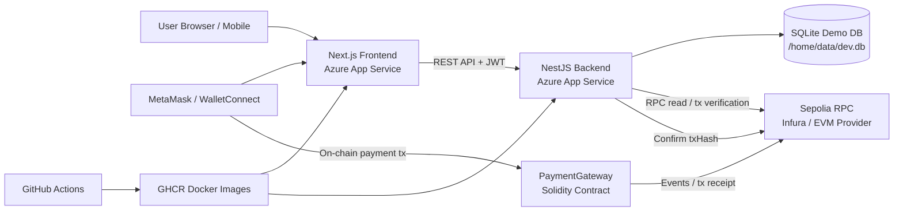

# Crypto Pay — On-Chain Payment Gateway MVP

[](https://github.com/ahamium/crypto-pay/actions/workflows/ci.yml)
[](https://github.com/ahamium/crypto-pay/actions/workflows/cd.yml)

A full-stack crypto payment gateway MVP that lets users sign in with Ethereum, create payment invoices, pay on-chain on Sepolia, and inspect payment activity through a public read-only admin dashboard.

The project is built as a production-style monorepo with Next.js, NestJS, Prisma, Hardhat, Docker, GitHub Actions, GHCR, and Azure App Service container deployment.

## Live Demo

- Frontend: `https://app-crypto-pay-fe.azurewebsites.net`
- Backend Health Check: `https://app-crypto-pay-be.azurewebsites.net/health`
- Network: Sepolia Testnet
- Payment Contract: [`0x1cc75CC740C60F4dD0f618D16838087352faD2b8`](https://sepolia.etherscan.io/address/0x1cc75CC740C60F4dD0f618D16838087352faD2b8)

The deployed admin dashboard is publicly viewable in read-only demo mode so reviewers can inspect payment records, statuses, and transaction hashes without needing an admin wallet. Operational actions such as CSV export and future write operations require admin-wallet authentication.

## Demo Flow

1. Open `/login`
2. Connect MetaMask or WalletConnect
3. Switch to Sepolia if required
4. Sign in with Ethereum
5. Open `/pay`
6. Create an invoice
7. Confirm the Sepolia transaction in MetaMask
8. Open `/admin`
9. Inspect payment status, transaction hash, payer address, and confirmations in the read-only dashboard
10. Sign in with the admin wallet to access protected actions such as CSV export

## Features

### Wallet Authentication

- Sign-In with Ethereum style wallet login
- Nonce-based signature verification
- JWT-based authenticated API calls
- MetaMask extension support on desktop
- WalletConnect support for mobile users
- Sepolia network detection and switching guidance

### Payment Flow

- Create payment invoices from the frontend
- Store invoice status as `pending`, `submitted`, `paid`, `failed`, or `expired`
- Support native Sepolia ETH payments
- Smart contract emits payment events for off-chain reconciliation
- Backend verifies submitted transaction hashes through RPC
- Prevents unsupported token payments through a token whitelist

### Admin Dashboard

- Public read-only admin dashboard for portfolio/demo reviewers
- Filter and sort payment records
- View invoice ID, status, chain ID, token, amount, payer, receiver, transaction hash, and confirmations
- Transaction hash links to Sepolia Etherscan
- Protected CSV export for admin-wallet users
- Designed so visitors can inspect the demo safely while operational actions remain restricted
- Responsive mobile-friendly login and admin UX

### DevOps / Deployment

- PNPM monorepo
- Dockerized frontend and backend
- GitHub Actions CI pipeline
- GHCR container image build and push
- Azure App Service container deployment
- OIDC-based GitHub Actions Azure login
- Smoke check for backend `/health` and frontend availability
- SQLite-based demo persistence on Azure App Service storage

## Tech Stack

### Frontend

- Next.js 15 App Router
- React
- TypeScript
- wagmi
- viem
- WalletConnect
- MetaMask

### Backend

- NestJS
- TypeScript
- Prisma
- SQLite for demo persistence
- JWT authentication
- ethers.js / RPC transaction verification
- Helmet, rate limiting, validation pipes
- Audit logging

### Blockchain

- Solidity
- Hardhat
- OpenZeppelin
- PaymentGateway smart contract
- Sepolia testnet
- Native ETH and ERC-20 compatible payment design

### DevOps

- PNPM workspaces
- Docker
- GitHub Actions
- GitHub Container Registry
- Azure App Service for Containers
- Azure App Settings for runtime configuration

## Architecture



## Monorepo Structure

```txt
crypto-pay/
├─ frontend/                  # Next.js App Router frontend
│  ├─ src/app/login            # Wallet login page
│  ├─ src/app/pay              # Invoice creation and on-chain payment page
│  ├─ src/app/admin            # Admin dashboard
│  ├─ src/components           # Reusable UI components
│  ├─ src/contracts            # ABI and deployed contract address
│  └─ src/lib                  # API, wagmi, payment helpers
│
├─ backend/                   # NestJS API
│  ├─ prisma                   # Prisma schema and seed
│  ├─ src/auth                 # SIWE-style auth and JWT
│  ├─ src/payments             # Invoice and payment APIs
│  ├─ src/admin                # Admin dashboard APIs
│  ├─ src/tx-verifier          # Transaction verification logic
│  └─ src/security             # Audit log, guards, Key Vault helper
│
├─ blockchain/                # Hardhat smart contracts
│  ├─ contracts                # PaymentGateway Solidity contracts
│  ├─ scripts                  # Deploy and ABI export scripts
│  └─ test                     # Contract tests
│
├─ ops/                       # Docker compose / infra helper files
├─ .github/workflows          # CI/CD workflows
└─ README.md
```

## Local Development

### Prerequisites

- Node.js 20+
- PNPM
- Docker Desktop with WSL integration
- MetaMask
- Sepolia test ETH
- Sepolia RPC provider such as Infura or Alchemy

Enable PNPM through Corepack:

```bash
corepack enable
corepack prepare pnpm@latest --activate
```

Install dependencies:

```bash
pnpm install
```

## Environment Variables

Do not commit real secrets. Use local `.env` files and Azure App Settings for deployed environments.

### Backend `.env`

```bash
DATABASE_URL="file:./dev.db"
JWT_SECRET="change_me_local_only"
CORS_ORIGIN="http://localhost:3000"
PORT=5000

RPC_URL="<SEPOLIA_RPC_URL>"
CHAIN_ID=11155111
CONTRACT_ADDRESS="<SEPOLIA_PAYMENT_GATEWAY_ADDRESS>"

MIN_CONFIRMATIONS=2
POLL_INTERVAL_SEC=20
MAX_VERIFY_RETRIES=30

ADMIN_ADDRESSES="<ADMIN_WALLET_ADDRESS>"

RATE_LIMIT_WINDOW_MS=900000
RATE_LIMIT_MAX=100
```

### Frontend `.env`

```bash
NEXT_PUBLIC_API_BASE_URL="http://localhost:5000"
NEXT_PUBLIC_NETWORK="sepolia"
NEXT_PUBLIC_WALLETCONNECT_PROJECT_ID="<OPTIONAL_WALLETCONNECT_PROJECT_ID>"
```

### Blockchain `.env`

```bash
RPC_URL="<SEPOLIA_RPC_URL>"
PRIVATE_KEY="<DEPLOYER_PRIVATE_KEY>"
CONTRACT_ADDRESS="<SEPOLIA_PAYMENT_GATEWAY_ADDRESS>"
```

## Database Setup

The backend uses Prisma. For local development:

```bash
cd backend
pnpm prisma generate
pnpm prisma db push
```

The demo seed inserts Sepolia native ETH into the token whitelist so that invoices can be created for native Sepolia ETH payments.

```bash
pnpm exec tsx prisma/seed.ts
```

If `tsx` is not configured in your backend package, run the seed through your configured Prisma seed command or execute the compiled seed file after build.

## Run Locally

Start the backend:

```bash
cd backend
pnpm start:dev
```

Backend health check:

```txt
http://localhost:5000/health
```

Start the frontend:

```bash
cd frontend
pnpm dev
```

Frontend:

```txt
http://localhost:3000
```

## Docker

Build and run through Docker Compose:

```bash
cd ops
docker compose up --build
```

Expected local services:

```txt
Frontend: http://localhost:3000
Backend:  http://localhost:5000/health
```

## Smart Contract

Compile contracts:

```bash
cd blockchain
pnpm hardhat compile
```

Run tests:

```bash
cd blockchain
pnpm test
```

Deploy to Sepolia:

```bash
cd blockchain
pnpm hardhat run scripts/deploy.ts --network sepolia
```

After deployment:

1. Copy the deployed contract address into:
   - `backend/.env`
   - `frontend/src/contracts/addresses.json`
   - Azure Backend App Settings as `CONTRACT_ADDRESS`

2. Export or sync the latest ABI into:
   - `frontend/src/contracts/PaymentGateway.abi.json`
   - `backend/src/contracts/PaymentGateway.abi.json`, if used

## CI/CD

### CI

The CI pipeline runs on push and pull request to `main`.

It performs:

- Dependency install
- Lint
- Tests
- Solidity coverage
- Build
- Docker image build
- Docker image push to GHCR

### CD

The CD workflow deploys containers to Azure App Service.

It performs:

- Azure OIDC login
- Backend container image update
- Frontend container image update
- App Service restart
- Smoke check:
  - Backend `/health`
  - Frontend root page

## Azure Runtime Configuration

### Backend App Settings

```bash
DATABASE_URL="file:/home/data/dev.db"
WEBSITES_ENABLE_APP_SERVICE_STORAGE="true"
NODE_ENV="production"
PORT="5000"
WEBSITES_PORT="5000"
JWT_SECRET="<PRODUCTION_SECRET>"
CORS_ORIGIN="https://app-crypto-pay-fe.azurewebsites.net"
RPC_URL="<SEPOLIA_RPC_URL>"
CHAIN_ID="11155111"
CONTRACT_ADDRESS="<SEPOLIA_PAYMENT_GATEWAY_ADDRESS>"
MIN_CONFIRMATIONS="2"
POLL_INTERVAL_SEC="20"
MAX_VERIFY_RETRIES="30"
ADMIN_ADDRESSES="<ADMIN_WALLET_ADDRESS>"
RATE_LIMIT_WINDOW_MS="900000"
RATE_LIMIT_MAX="100"
```

### Frontend App Settings

```bash
NODE_ENV="production"
PORT="3000"
WEBSITES_PORT="3000"
NEXT_PUBLIC_API_BASE_URL="https://app-crypto-pay-be.azurewebsites.net"
NEXT_PUBLIC_NETWORK="sepolia"
NEXT_PUBLIC_WALLETCONNECT_PROJECT_ID="<OPTIONAL_WALLETCONNECT_PROJECT_ID>"
```

## API Overview

### Health

```txt
GET /health
```

Returns backend health status.

### Auth

```txt
GET /auth/nonce?address=<walletAddress>
POST /auth/verify
```

Used for wallet signature authentication and JWT issuance.

### Payments

```txt
POST /api/payments
GET /api/payments/:invoiceId
PATCH /api/payments/:invoiceId/confirm
```

Used to create invoices, retrieve invoices, and confirm on-chain transactions.

### Admin

```txt
GET /admin/payments
GET /admin/payments/export.csv
```

GET /admin/payments is publicly available as a read-only demo endpoint for portfolio reviewers. It allows visitors to inspect payment records, statuses, and transaction hashes.

GET /admin/payments/export.csv is protected and requires admin-wallet authentication.

## Limitations

This is an MVP/demo project, not a production payment processor.

Current limitations:

- Uses Sepolia testnet
- Uses SQLite for demo persistence
- Uses App Service storage for deployed SQLite demo DB
- The deployed admin dashboard exposes a public read-only demo view. Production deployments should restrict sensitive data and operational actions with stronger RBAC, audit logging, and managed database access.
- Native Sepolia ETH is seeded by default
- ERC-20 flow is contract/API compatible but requires token whitelist configuration
- Production deployments should use PostgreSQL or another managed database
- Production deployments should add stronger observability, alerting, key management, and operational runbooks

## What This Project Demonstrates

- Full-stack TypeScript development
- Smart contract integration
- Wallet-based authentication
- On-chain transaction execution
- Backend transaction verification
- Admin dashboard implementation
- Dockerized deployment
- CI/CD with GitHub Actions and Azure
- Practical dApp UX handling for desktop and mobile wallets
